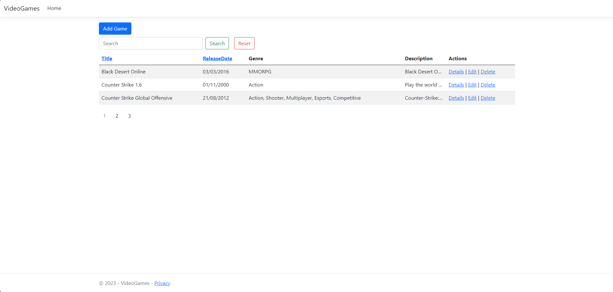
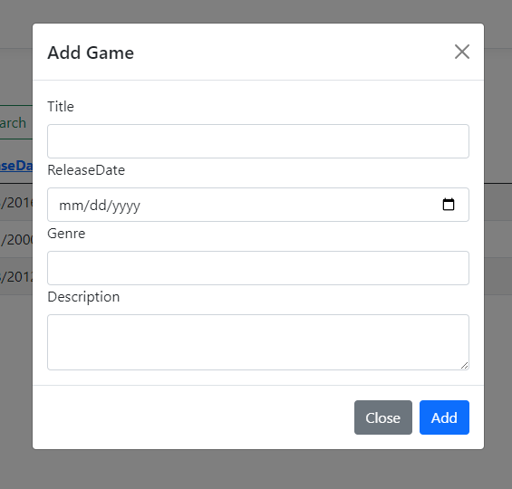
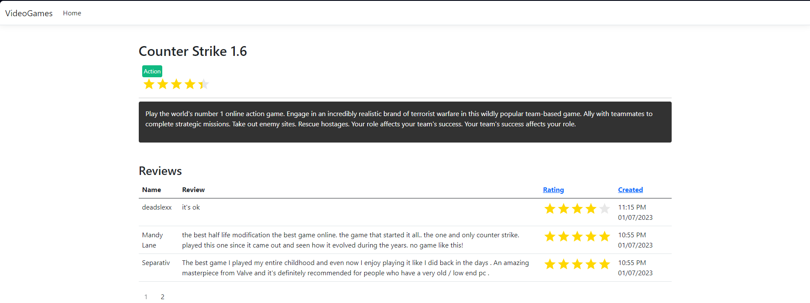
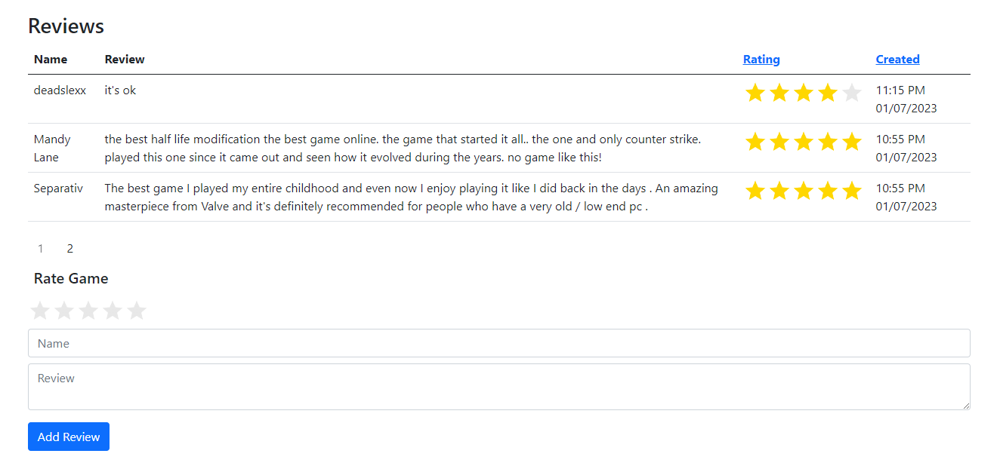

# VideoGames
# Game Library

Welcome to the Game Library project! This project is a web-based game library implemented using ASP.NET MVC with C#. It allows users to browse and interact with a collection of games. The library provides features such as game details, user reviews, and the ability to add new reviews.

## Table of Contents

- [Getting Started](#getting-started)
  - [Prerequisites](#prerequisites)
  - [Installation](#installation)
- [Usage](#usage)
- [Interface](#interface)
- [Contributing](#contributing)
- [License](#license)

## Getting Started

To get started with the Game Library project, follow the instructions below.

### Prerequisites

To run the project, make sure you have the following software installed on your system:

- [.NET Framework](https://dotnet.microsoft.com/download/dotnet-framework) (minimum version 6.1)

### Installation

1. Clone the repository to your local machine:

   ```bash
   git clone https://github.com/human416c6578/VideoGames
   ```

2. Open the project in your preferred Integrated Development Environment (IDE) that supports ASP.NET MVC with C#, such as Visual Studio.

3. Build the project to restore dependencies and compile the code.

4. Start the project within the IDE or deploy it to a web server.

That's it! You're now ready to use the Game Library.

## Usage

Upon running the Game Library, you'll be presented with the main page featuring a table containing various games. The table includes information such as game name, release date, description, and actions.

### Game Details

To view detailed information about a specific game, click on the "Details" button in the action cell of the corresponding game row. This will take you to a page displaying the game's details, including the game name, genre, description, and game rating.

### User Reviews

On the game details page, you'll find a section dedicated to user reviews. The section includes a table displaying existing reviews, consisting of the following columns:

- Name: The name of the user who submitted the review.
- Review: The content of the review.
- Rating: The rating given by the user.
- Create Date: The date when the review was submitted.

### Adding a Review

Below the reviews table, there is a form that allows you to add your own review for the game. The form includes the following inputs:

- Name: Your name.
- Review: The content of your review.
- Rating: Your rating for the game.

To submit your review, fill in the required information and click the "Add Review" button.

## Interface
Here are some screenshots of the Game Library interface:

Main Page:


Add Game Form:


Game Details Page:


User Reviews Section:


## Contributing

Contributions to the Game Library project are always welcome! If you'd like to contribute, please follow these steps:

1. Fork the repository.
2. Create a new branch: `git checkout -b my-new-feature`.
3. Make your changes and commit them: `git commit -am 'Add new feature'`.
4. Push the branch: `git push origin my-new-feature`.
5. Submit a pull request.

## License

The Game Library project is licensed under the [MIT License](LICENSE). You are free to modify, distribute, and use the code as per the terms of this license.

Please note that this project is provided as-is without any warranty. Use it at your own risk.

---

Thank you for using the Game Library! If you have any questions or encounter any issues, please don't hesitate to [open an issue](https://github.com/your-username/game-library/issues).
